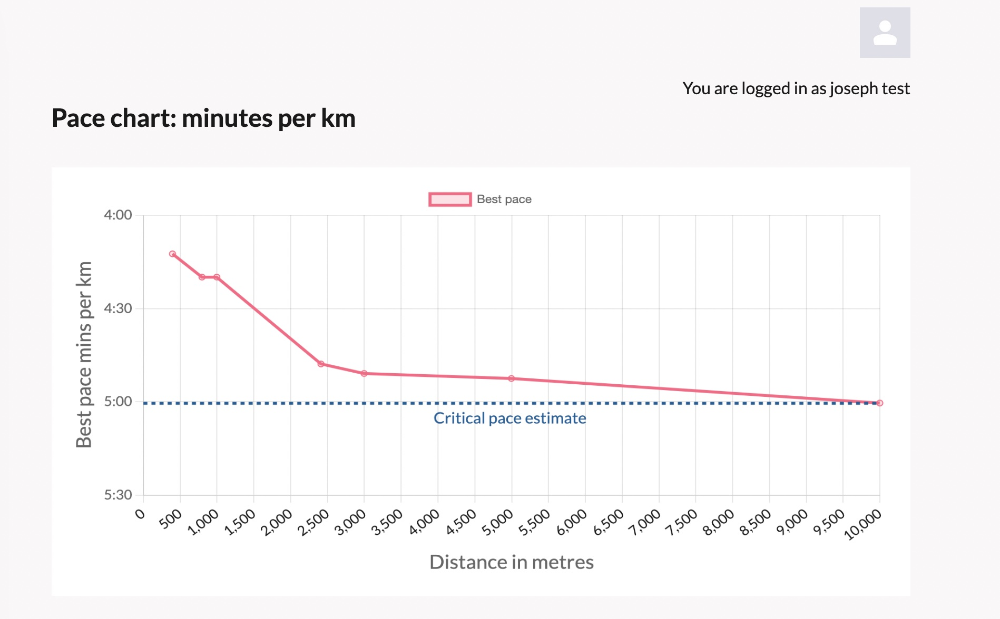

# Node/React Strava API application

### NOTE 1. The original application was built for a Bsc computing project. The folders with my Bsc work were in Node (the node/express server) and strava-app, which was built using create react-app. I have considered moving over some of the app to nextjs (this is the strava folder - but this is work in progress and not finished!)

### NOTE 2. At the moment this is a demo app as I only have limited Strava API access. Due to the demo access to the strava api - only certain accounts are allowed to use the app. 

Site: [https://www.stravaanalytics.space/](https://www.stravaanalytics.space/)

This application takes data from the Strava API to analyse a user's data. The app produces a cycling power curve and a pace graph, from raw strava data. This is data then used to make predictions. A user's 5k performance is used to esimtate their performance over longer distances using linear regression. I also use a power graph and the athlete's weight to estimate time up a climb. My inspiration was strava sauce [described here in a road.cc article](https://road.cc/content/tech-news/sauce-strava-releases-ps2-month-analysis-tools-290433O). My aim was to improve on some of Strava Sauce's analytics - and offer more predictive insights. 


*Hill climb predicted time using polynomial regression.*


*An athlete's power curve*


*An athlete's pace graph*


*Half marathon prediction using linear regression.*

## Description of folders

The strava-app is the front end of the applications made in React. The node folder is the server
made using node/express. The cypress folder just contains end to end testing files.

## The Live site

[https://www.stravaanalytics.space/](https://www.stravaanalytics.space/).

Please use the test Strava account I have given at the top of the report for authentication. 

## Instructions for running node-react strava app in a container

Run git clone or download a zip file of the code. Then from the command line cd into the root of the entire project. Ensure the Docker Daemon is running and then from the root of the project run:

```
docker compose build
```
```
docker compose up
```


